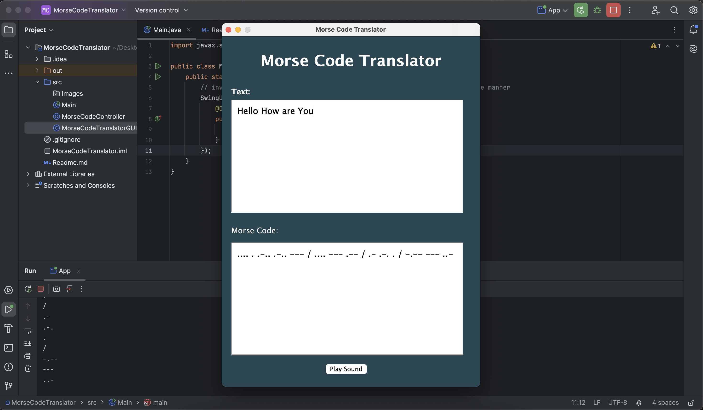
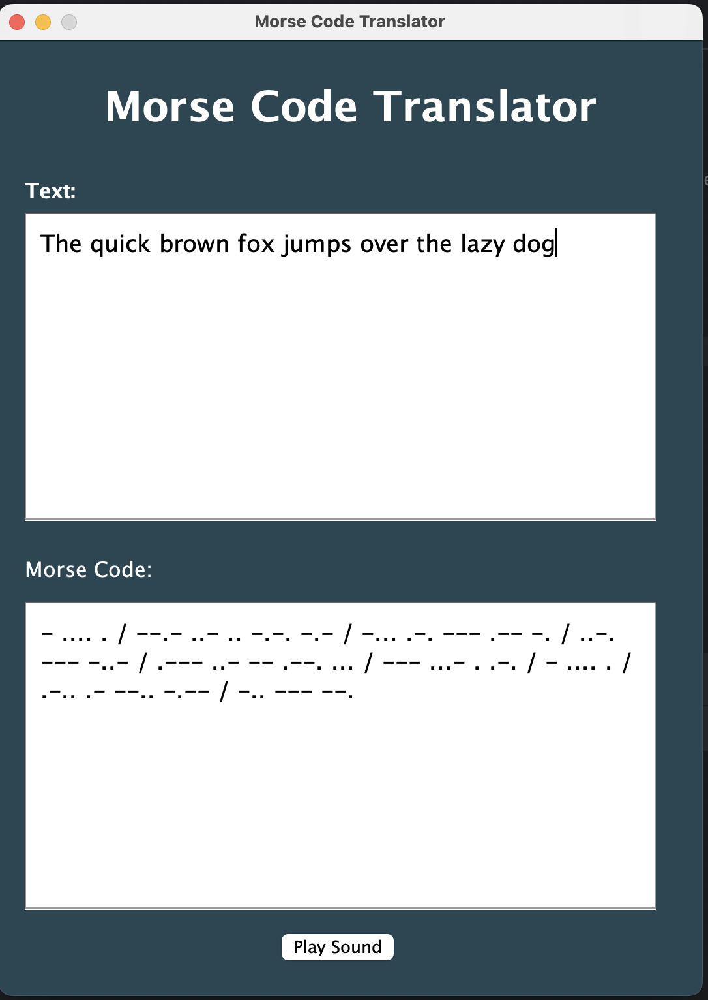

# Morse Code Translator

A simple Morse Code Translator application built with Java and Java Swing that allows users to convert text into Morse code. The application also generates sound for the corresponding Morse code.

## What is Morse Code?
Morse code is a method of encoding text using sequences of dots (short signals) and dashes (long signals) to represent letters, numbers, and punctuation. It allows communication through sound, light, or visual signals, often used in telegraphy and emergency situations.

## Features
1. Text to Morse Code: Converts regular text into its corresponding Morse code representation.
2. Interactive GUI: A user-friendly interface built with Java Swing.
3. Real-time Translation: Instantly displays the translation as the user types.
4. Morse Code Sound: Plays audible Morse code sounds for each symbol (dot and dash).

## Technologies
- Java: The core programming language for implementing logic.
- Java Swing: A lightweight GUI toolkit for building the graphical interface.

## Installation
1. Clone the repository: 
    ```bash
   git clone
   ```
2. Open the project in your IDE.
3. Build and run the project.

## Demo


